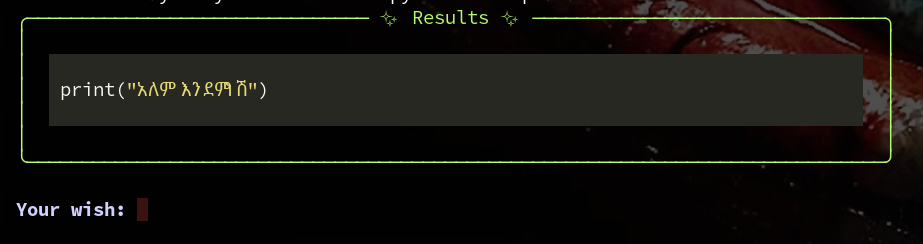
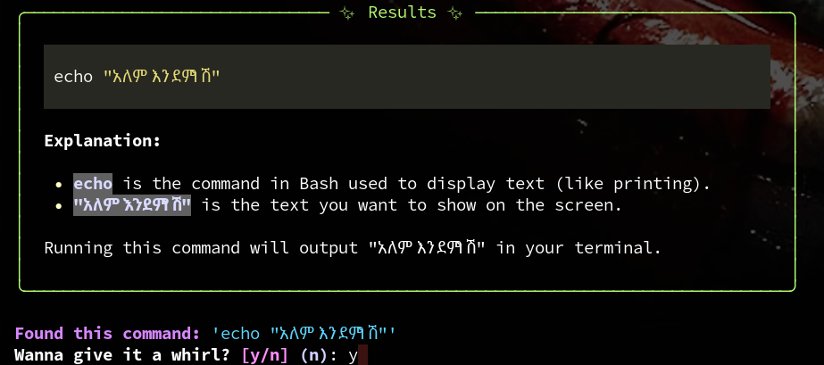

### Fancy Agent

Fancy-Agent is a command-line interface (CLI) tool designed to assist with code generation, syntax highlighting, and interactively prompting users to execute commands.


#### Features
- **Markdown Handling**: Process and display markdown content in the terminal.


- **Command Execution Prompt**: If commands are detected it will prompt users to execute them.


#### Installation

```bash
git clone https://github.com/elphador/cli-agent.git
```
```bash
cd cli-agent
```
```bash
pip install -r requirements.txt
```
```bash
chmod +x main.py
```
```bash
sudo cp main.py /usr/local/bin/agent
```

```bash
export GEMINI_API_KEY="your api key" #Gemini API key from Google 
#add this in to your .bashrc or .zshrc config 
```
#### Usage

Once installed, you can call it from anywhere but you have to set your gemini api key global :


``` bash
agent #example 
```

#### To Do
- [ ] multiple model support
- [ ] files read write 
- [ ] system prompt improvement


##### Contributors
- [**Kenean Dita**](https://github.com/KeneanDita/)
